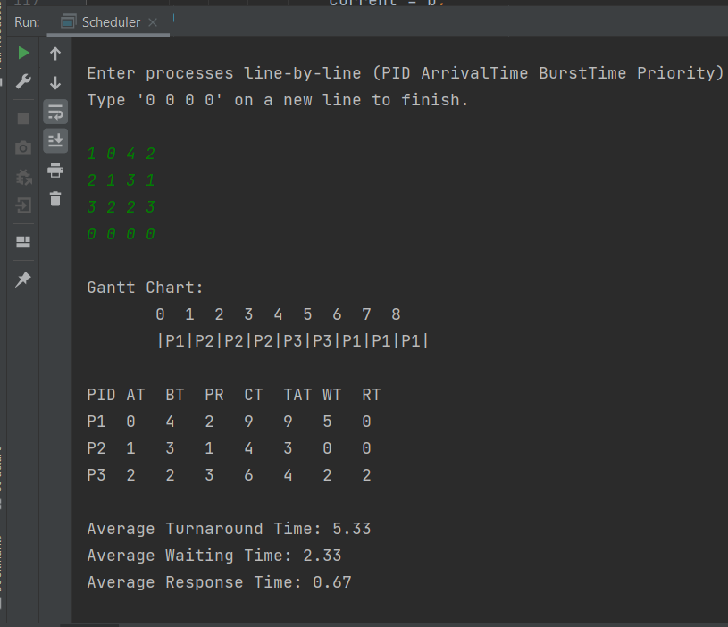

# Priority with SRTF CPU Scheduling Simulator

## 🧠 Purpose
This Java program simulates **CPU scheduling** using a hybrid algorithm:  
**Priority-based scheduling with Shortest Remaining Time First (SRTF)**.

It is designed to:
- Accurately model how operating systems schedule processes.
- Help students understand how both **priority** and **remaining burst time** influence process execution.
- Allow interactive input and provide clear output including a **Gantt chart** and **performance metrics** (TAT, WT, RT).

---

## 📌 Features

- Input multiple processes (PID, Arrival Time, Burst Time, Priority).
- Automatically handles:
    - Invalid characters or formatting.
    - Negative values and zero burst time.
    - Duplicate PIDs.
    - The case where the user enters `0 0 0 0` immediately.
- Calculates:
    - Completion Time
    - Turnaround Time (TAT)
    - Waiting Time (WT)
    - Response Time (RT)
- Prints a visual **Gantt Chart**.
- Displays **averages** for key performance metrics.
- Prevents the program from continuing without valid processes.

---

## ⚙️ How It Works

1. **User Input**:
    - The user enters processes one by one in the format:
      ```
      PID ArrivalTime BurstTime Priority
      ```
    - Ends input with:
      ```
      0 0 0 0
      ```

2. **Validation**:
    - Checks if all lines contain exactly four numbers.
    - Ensures Arrival Time and Priority are ≥ 0, Burst Time > 0.
    - Ensures no duplicate PIDs.

3. **Scheduling Logic**:
    - At each time unit, the scheduler chooses the process that:
        - Has the shortest remaining time.
        - If tied, has the higher priority (lower number).
    - Preemptive: the CPU can switch if a new eligible process arrives.
    - Tracks Gantt chart entries at every time unit.
    - Updates process metrics upon completion.

4. **Output**:
    - Shows Gantt chart.
    - Prints a table of all process data and metrics.
    - Shows average Turnaround Time, Waiting Time, and Response Time.

---

## 📥 Input Format & 📤 Output Sample
```
1 0 4 2
2 1 3 1
3 2 2 3
0 0 0 0
```

</img>


---

## 👩‍💻 Authors


 


---

## 📝 Note

This project is part of an academic assignment to simulate CPU scheduling. It does **not interact with real operating system processes**, but rather uses theoretical modeling for educational purposes.
